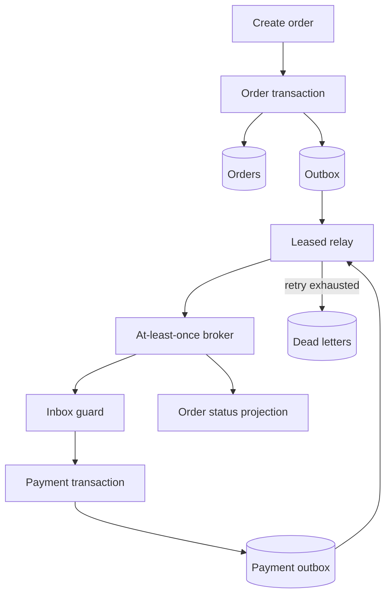
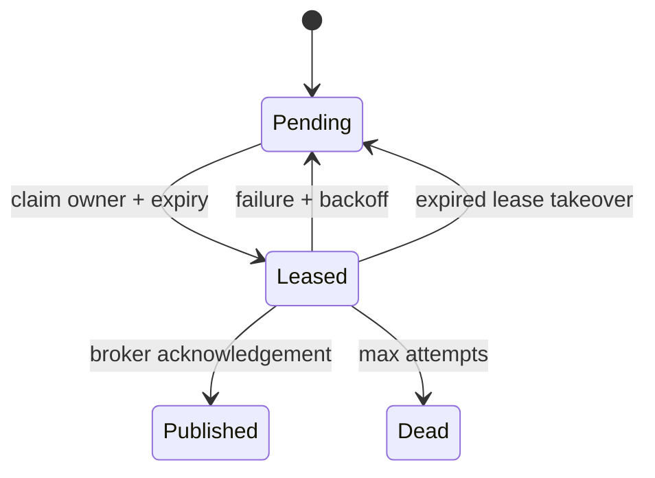

# Transactional Event Platform

[](https://github.com/cagataykavas/event-driven-microservices/actions/workflows/ci.yml)

A runnable reference implementation of **transactional outbox, leased publication, bounded retries, dead-letter quarantine, idempotent consumers and at-least-once delivery**. It models the failure boundaries behind an order-to-payment workflow instead of presenting message-broker diagrams without transaction semantics.

The local runtime uses SQLite and an injected deterministic broker so every failure mode runs in CI. The AWS SAM mapping uses SNS, SQS, Lambda partial-batch responses and DynamoDB transactions.

## Delivery topology



## What is guaranteed

| Failure boundary | Implemented behavior | Verification |
|---|---|---|
| API retry | command fingerprint and response stored under an idempotency key | exact replay + changed-payload conflict tests |
| Process crash after order insert | order, receipt and integration event share one transaction | aggregate/outbox/receipt assertion |
| Multiple relay workers | rows carry owner and expiry leases | active lease and expired takeover tests |
| Broker outage | exponential `available_at` backoff with bounded attempts | injected first-failure recovery test |
| Poison event | terminal outbox state plus durable dead-letter record | bounded-attempt test |
| Duplicate delivery | inbox key is `(consumer, message_id)` | triple-delivery scenario |
| ID reuse with changed bytes | canonical payload SHA-256 must match | mutation quarantine test |
| Consumer crash | business effect, emitted event and inbox receipt share one transaction | rollback test |
| Lambda batch poison item | only failed SQS identifiers are returned | partial-batch handler contract |
| Lambda replay after SNS uncertainty | deterministic output event ID is republished | downstream-dedup identity test |

Exactly-once transport is not claimed. The system provides **effectively-once business effects** by composing at-least-once delivery with transactional inbox/outbox boundaries.

## Domain and persistence model

Money is represented as integer minor units after `Decimal` quantization—never binary floats. Events carry event, aggregate, correlation and causation IDs plus an explicit schema version. Canonical JSON supports stable fingerprints.

The SQLite schema contains:

- `orders`: versioned aggregate projection;
- `command_receipts`: API idempotency fingerprint and replay response;
- `outbox`: publication state, attempt count, lease and next availability;
- `inbox`: consumer-scoped message identity and payload fingerprint;
- `payments`: exactly-once billing side effect;
- `dead_letters`: terminal failure evidence.

`BEGIN IMMEDIATE` gives the local implementation a clear single-writer transaction boundary. SQLite is used for executable semantics; replacing it with PostgreSQL would use `FOR UPDATE SKIP LOCKED` for concurrent outbox claims.

## Run the reference workflow

```bash
pip install -e '.[dev]'
event-platform --duplicate-deliveries 3 --output artifacts/reference-scenario.json
```

The scenario creates one order below and one above the billing authorization limit. With every message delivered three times, the workflow converges to:

```json
{
  "orders_created": 2,
  "confirmed": 1,
  "rejected": 1,
  "published_messages": 4,
  "inbox_receipts": 4,
  "dead_letters": 0,
  "relay_cycles": 2
}
```

This is deterministic correctness evidence, not a throughput benchmark.

## Relay state machine



The relay acknowledges only a row it still owns. Errors are truncated before persistence, backoff is capped, and ordering is deterministic by occurrence time and event ID.

## AWS execution boundary

`infra/aws/serverless.yaml` maps the same semantics to:

- encrypted SNS order and payment topics;
- encrypted SQS billing queue with 14-day DLQ retention;
- event-type subscription filtering;
- Lambda partial-batch failure responses and bounded concurrency;
- DynamoDB inbox, payment and output-event records committed with `TransactWriteItems`;
- deterministic payment event identity on retry;
- DLQ depth alarm and X-Ray active tracing;
- least-scope SAM policy templates for tables and publication.

The Lambda adapter imports `boto3` only inside the AWS entrypoint, keeping domain tests SDK-free. A transaction cancellation is accepted as a duplicate only if a strongly consistent inbox read confirms the same payload hash; otherwise it becomes a mutation failure.

## Repository map

```text
event_platform/domain.py       typed commands, envelopes, money, fingerprints
event_platform/storage.py      schema and transaction boundary
event_platform/orders.py       atomic command + order + outbox service
event_platform/relay.py        leases, acknowledgement, retry and DLQ
event_platform/consumers.py    transactional inbox and billing/projection handlers
event_platform/broker.py       deterministic at-least-once test transport
event_platform/simulation.py   convergent end-to-end reference scenario
lambda_handlers/billing.py     SQS/DynamoDB/SNS production adapter
infra/aws/serverless.yaml      deployable AWS resource mapping
tests/                         domain, failure, replay and convergence tests
```

## Verification

```bash
ruff check .
ruff format --check .
pytest -q
python -m build
sam validate --template-file infra/aws/serverless.yaml
```

CI runs 17 behavioral tests, builds and installs the wheel outside the checkout, emits a downloadable scenario artifact, and validates the AWS SAM template.

## Intentional scope

This repository demonstrates delivery and transaction semantics. It does not pretend a local in-memory broker is Kafka, nor that a two-order scenario establishes production capacity. Schema registry compatibility, multi-region failover, replay tooling and PostgreSQL/Kafka integration would be separate operational work—not README claims.
